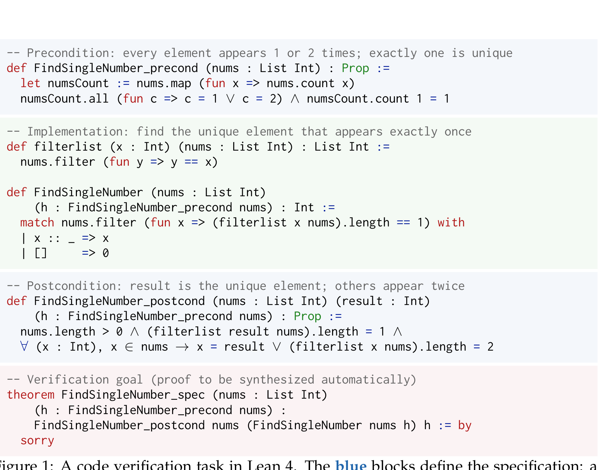
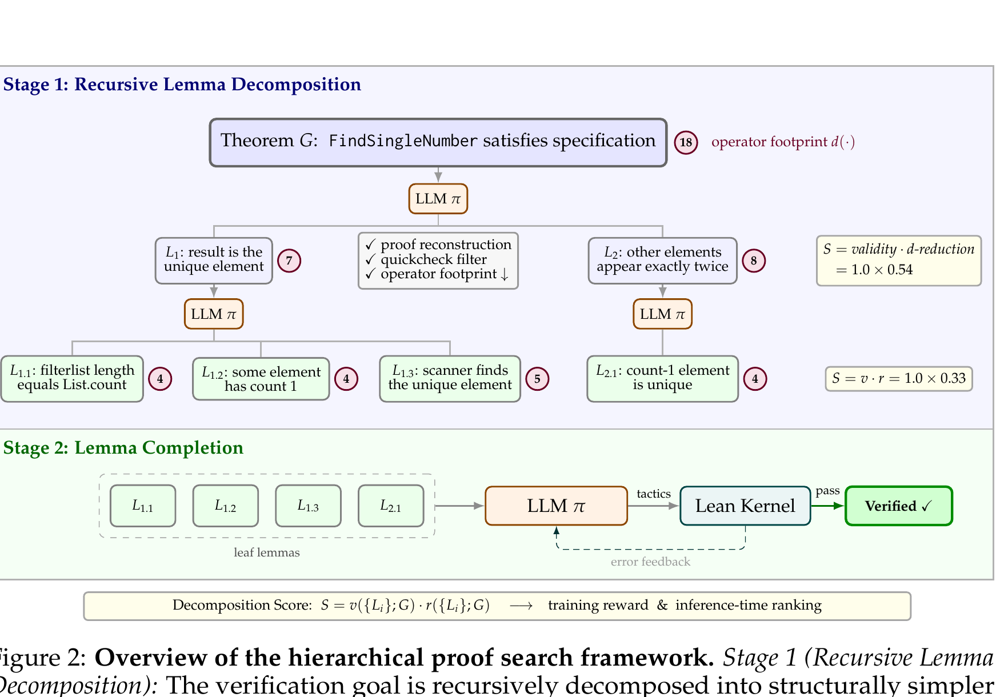
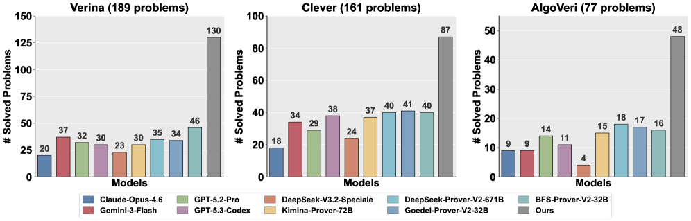
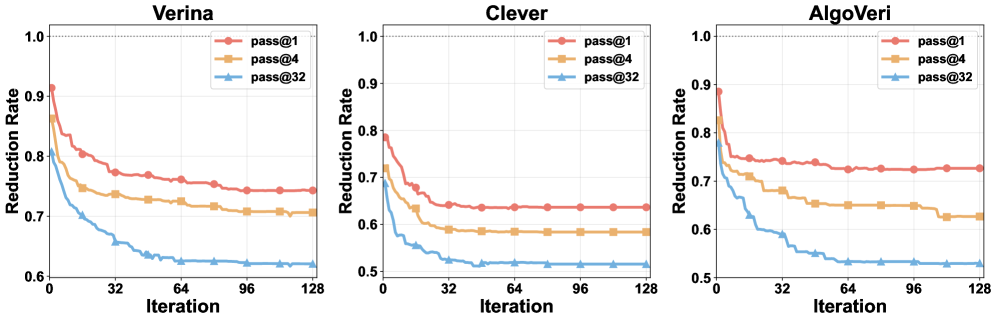
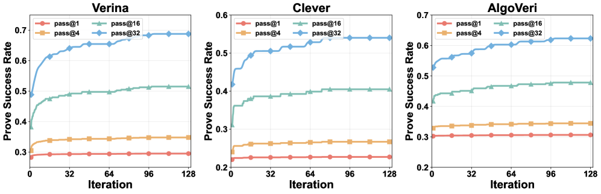
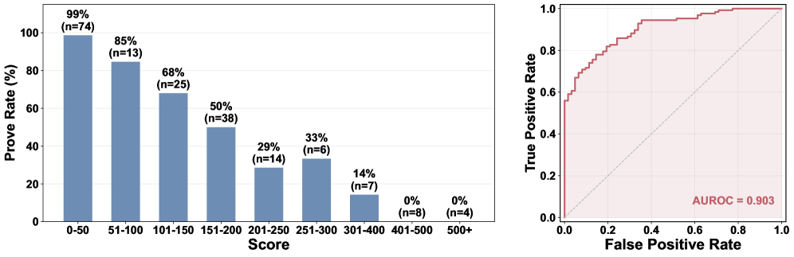

# Goedel-Code-Prover paper

## Why this paper is interesting
This paper is a strong example of long-horizon reasoning being made practical by adding structure to the search process instead of only scaling the base model. The target task is Lean 4 code verification: given code plus a formal spec, generate machine-checkable proofs that the implementation really satisfies the specification.

The central claim is simple but important: flat proof generation is too brittle for hard verification tasks, so the model should first break a theorem into structurally simpler lemmas and only then attempt local proof completion. That is the paper's main move.

## Problem setup
The authors frame the gap very clearly:
- LLMs can generate plausible code
- testing cannot certify absence of subtle logical bugs
- formal verification can certify correctness, but constructing proofs is still too hard to automate reliably

In Lean 4 verification, even a seemingly modest task often needs auxiliary lemmas that are not obvious from the original specification. So the bottleneck is not just tactic generation. It is discovering a useful proof structure.

### Task example

Figure 1 makes the task concrete instead of leaving the paper at the level of abstract theorem proving. It shows the three-part structure of a Lean verification problem:
- blue blocks: formal specification
- green block: implementation
- red block: the top-level theorem whose proof must be synthesized

This figure matters here because it explains why decomposition is needed at all. Even a compact verification task already hides multiple auxiliary obligations that are not explicit in the original theorem statement.

## Main method in one sentence
Use one 8B policy to do both theorem decomposition and lemma completion, and rank decompositions with a single score that is reused consistently in both training and inference.

## The core architecture
The paper's framework has two stages.

Figure 2 is the most important figure for understanding the paper's core mechanism.
It shows the full two-stage loop:
- recursively decompose the top-level theorem into simpler lemmas
- score decompositions using validity times structural reduction
- prove the leaf lemmas with iterative compiler-guided completion

Even more importantly, the figure makes clear that the same decomposition score drives both reward and ranking.
That training/inference alignment is the deepest design choice in the paper.

### Stage 1: recursive lemma decomposition
The model takes a hard verification goal G and proposes sub-lemmas L1 ... Lk.
A decomposition is only accepted if it passes two filters:

1. proof reconstruction
   The proposed lemmas must actually imply the parent theorem, and Lean must verify that reconstruction.

2. quickcheck
   Each proposed lemma is tested with automated counterexample search so vacuous or false lemmas are filtered out early.

So the system is not allowed to invent arbitrary subgoals. It must produce lemmas that are both logically connected to the parent goal and empirically nontrivial.

### Stage 2: iterative lemma completion
Once the search tree ends in leaf lemmas, the same policy switches roles and tries to prove each remaining lemma by generating Lean proof code and refining it using compiler feedback.

So the system is hierarchical in a very literal sense:
- planning first
- local proving second

This is the part that matters most. The paper is not just a bigger prover. It is a prover with an explicit planning layer.

## The decomposition score is the real heart of the paper
The key technical idea is the decomposition score S.

The score combines:
- validity v: whether proof reconstruction succeeds and all lemmas survive quickcheck
- reduction r: whether the decomposition makes the task structurally easier

The final score is:
- S = v * r

What makes this elegant is that they use the same score twice:
- as the reinforcement-learning reward during training
- as the ranking criterion during inference-time search

That alignment matters a lot. In many systems, the training objective and deployment heuristic are slightly different, which causes optimization mismatch. Here the authors explicitly make them the same object.

## How they define "simpler"
Their notion of simplification is not vague. They measure the operator footprint of a goal: roughly the number of logical and domain-specific operators in the Lean AST.

Examples of what this captures:
- logical connectives and quantifiers
- arithmetic operators
- data-structure operators
- program-specific operators like list operations

A good decomposition should reduce this structural burden. Instead of only looking at the hardest child lemma with a hard max, they use a LogSumExp aggregation over subgoal difficulty. That gives a smoother objective and rewards partial progress even when the hardest subgoal does not change abruptly.

This is a nice design choice because it makes the reward more learnable while still approximating worst-case hardness.

## Training pipeline
The training setup is more thoughtful than a simple SFT story.

### Supervised initialization
They first generate scaffolded trajectories using stronger frontier models, producing:
- 281K decomposition pairs
- 151K completion pairs

These are used to initialize a Qwen-3-8B backbone.

### Hybrid RL
Then they apply a hybrid objective:
- GRPO for decomposition, driven by the continuous decomposition score
- supervised replay for completion, since proof completion has sparse binary success signals and is harder to optimize directly with RL

This split is important. The authors explicitly say naive joint optimization would let the dense decomposition reward dominate while completion stagnates. Their fix is to decouple the learning signals while keeping one shared policy.

That is one of the most convincing engineering decisions in the paper.

## Inference pipeline
At inference time the system runs in two explicit phases.

### Decomposition phase
- maintain an open-goal set
- select the most complex remaining goal
- attempt a decomposition
- verify it with proof reconstruction and quickcheck
- replace the parent with accepted children
- repeat until budget is exhausted

### Completion phase
- collect all remaining leaf lemmas
- generate proof candidates for each one
- use Lean compiler feedback to refine them
- stop when all close or the budget is used up

The paper also supports pass@k style parallel runs, which turns the hierarchical search into a scalable inference-time compute story rather than a single deterministic pipeline.

## What was actually validated
The headline result is:
- 62.0% overall prove success on 427 Lean-based verification tasks
- benchmark breakdown: 68.8% on Verina, 54.0% on Clever, 62.3% on AlgoVeri
- 2.6x improvement over the strongest baseline across all benchmarks

Figure 3 is the main performance summary. It shows that the framework beats all baselines across Verina, Clever, and AlgoVeri under the paper's evaluation setup.

The paper also emphasizes efficiency:
- the model is only 8B parameters
- it beats neural provers in the 32B to 671B range
- it keeps improving with more search iterations and larger pass@k budgets

That combination is what makes the result notable. This is not just a giant model brute-forcing proofs. It is a smaller model with better search structure.

## What the ablations really say
The ablation table is very informative.

On Verina:
- no decomposition + Gemini completion: 26.4
- GPT-5.2-Pro decomposition + Gemini completion: 54.4
- their decomposition + Gemini completion: 58.2
- GPT-5.2-Pro decomposition + their completion: 59.2
- their decomposition + their completion: 68.7

The meaning is pretty clean:
- decomposition is the single biggest lever
- their trained decomposer is better than just prompting a strong frontier model
- their trained completer also matters substantially
- best performance comes from co-adapting both modules together

That strongly supports the paper's main thesis that decomposition is not just a helper trick. It is the central capability.

Figure 4 shows decomposition reduction rate versus iterations. Lower is better, meaning the system is finding simpler subgoals as search continues. This matters because it empirically validates that the planner is not just branching more; it is actually simplifying the proof state over time.

Figure 5 shows prove success rate increasing with more completion iterations and higher pass@k budgets. This is one of the strongest practical messages in the paper: the system has a real inference-time scaling law instead of rapidly saturating.

Figure 6 shows decomposition score versus prove rate on Verina. The reported AUROC is 0.903, which is strong evidence that the ranking score is not arbitrary; it is genuinely predictive of downstream proof success.

## Important nuance: failure analysis
One very interesting part is that decomposition often fails.

Reported decomposition failure rates:
- proof reconstruction failure: 44.9% to 59.4%
- quickcheck failure in runs: 31.8% to 46.4%

This is actually useful evidence, not a weakness to hide. It shows the planning problem is genuinely hard and that the filtering layers are doing real work. Without them, the search would likely waste enormous budget on bad branches.

## My interpretation
This paper is exciting because it points toward a strong pattern for reasoning agents:
- do not treat long-horizon reasoning as one flat autoregressive generation problem
- learn to propose intermediate structure
- score the structure with a domain-grounded signal
- use the same signal for both policy learning and inference control

That pattern should generalize beyond Lean verification.
It feels relevant to:
- code agents that must plan before editing
- theorem provers that need subgoal discovery
- research agents that need decomposition before synthesis
- robotics or long-horizon planning systems where intermediate subgoals are more important than single-step fluency

## Limits and open questions
The paper is strong, but there are still real questions worth following up on:
- how much of the gain comes from the decomposition objective itself versus the benchmark/task construction?
- how robust is quickcheck as a semantic filter on more complicated specs?
- does the operator-footprint metric remain good when proof difficulty is dominated by semantic insight rather than syntactic structure?
- how much transfer would this method have outside Lean-based code verification?
- how expensive is the full search in wall-clock terms compared with flat proof generation?

## Bottom line
This is one of the more interesting recent papers in code verification and machine reasoning because it does not just scale a prover. It introduces a usable hierarchical search design with a well-aligned scoring function and shows that structure can beat size.

For your archive, this is absolutely a high-priority paper. It connects directly to theorem proving, RL, code verification, long-horizon reasoning, and the broader question of how agent systems should plan instead of merely autocomplete.
