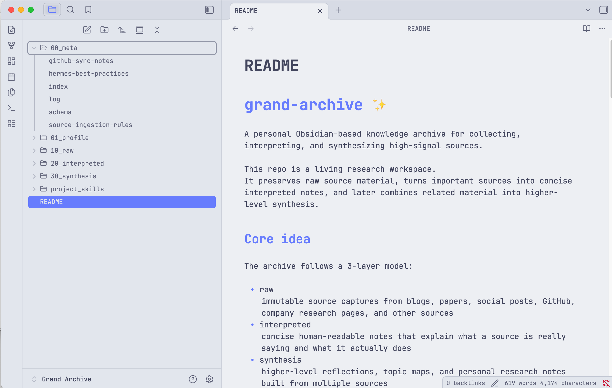

# grand-archive ✨

A personal Obsidian-based knowledge archive for collecting, interpreting, and synthesizing high-signal sources.

This repo is a living research workspace.
It preserves raw source material, turns important sources into concise interpreted notes, and later combines related material into higher-level synthesis.

## Core idea

The archive follows a 3-layer model:

- raw
  immutable source captures from blogs, papers, social posts, GitHub, company research pages, and other sources
- interpreted
  concise human-readable notes that explain what a source is really saying and what it actually does
- synthesis
  higher-level reflections, topic maps, and personal research notes built from multiple sources

## Current structure

- `00_meta/`
  system notes, index, schema, operating rules, and log
- `01_profile/`
  personal taste, interests, seed sources, and source preferences
- `10_raw/`
  captured source material and static source artifacts
- `20_interpreted/`
  concise source interpretations
- `30_synthesis/`
  cross-source synthesis and reflection
- `project_skills/`
  project-local skill files that act like reusable control logic for the archive

## Future software-engineering idea

This archive is not just a notes repository.
It is an early sketch of a different software-engineering style for agents.

The important thing is not the script alone.
Scripts are cheap and can be generated quickly.
The more durable value is in how reusable capabilities are decomposed, routed, and composed together.

Markdown files are starting to play the role of compact software modules:
- some files describe search behavior
- some files describe source-type routing
- some files describe ingest behavior
- some files define note quality
- some files define synthesis behavior

That means a workflow can be described like software logic:
- for each source, run ingest
- inside ingest, branch on source type
- normalize everything into raw first
- interpret each important source into a readable note
- only then synthesize across related sources

This is the key architectural idea:
source -> raw normalization -> interpreted note -> synthesis

So the project is moving toward a model where skills cooperate like functions in a software system.
The agent does not just execute one-off prompts.
It runs reusable control logic encoded in project markdown files.

## Writing philosophy

Interpreted notes are intentionally concise.
They should focus on:
- what a source is trying to solve or say
- why it matters
- what it actually does
- the most important figure or image when useful
- what was truly validated

They should avoid:
- inflated concept dumping
- excessive setup detail
- decorative architecture explanation without evidence
- confusing proposed ideas with validated results

## Source policy

The archive prefers high-signal, primary, builder-oriented sources such as:
- impactful personal blogs
- GitHub repositories and profiles
- GitHub Pages essays and course pages
- X / Twitter threads
- arXiv papers
- newsletters
- podcasts and YouTube transcripts

Sources are added dynamically.
Folders for raw material are created when needed rather than fixed in advance.

## Static artifact policy

Static source artifacts belong in raw, not interpreted.
That includes:
- PDFs
- HTML exports
- screenshots
- copied figures
- transcripts
- downloaded media

Interpreted notes should stay clean and link back to raw artifacts.

## Repository purpose

This repository is meant to become a compounding personal archive that helps:
- track interests and taste over time
- preserve source provenance
- normalize heterogeneous inputs into a stable local layer
- make future synthesis easier
- support question answering and research workflows inside Obsidian
- experiment with a markdown-native style of agent software engineering

## Next directions

- tighten the interpreted-note template
- improve source-type routing in project_skills
- keep converting seed sources into stronger interpreted notes
- improve image and figure handling from PDF/HTML-native artifacts
- evolve the markdown skill layer into a more explicit reusable agent architecture
